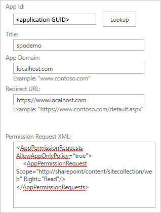
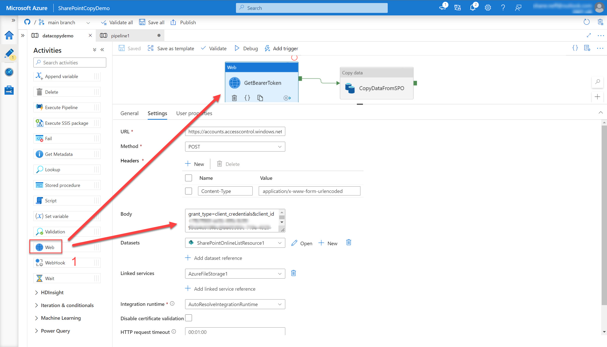

# Copying files from SharePoint Online to Azure Files

*Shane Neff*

*Senior Cloud Solution Architect- Microsoft*

*5/31/2022*

---

# Table of contents

- [Copying files from SharePoint Online to Azure Files](#copying-files-from-sharepoint-online-to-azure-files)
  - [Pre-requisites:](#pre-requisites)
  - [Azure Environment Setup](#azure-environment-setup)
  - [Azure AD Setup](#azure-ad-setup)
  - [SharePoint Setup](#sharepoint-setup)
  - [Create Azure Data Factory Resource in Azure](#create-azure-data-factory-resource-in-azure)
  - [Creating the ADF Pipeline to copy SharePoint files](#creating-the-adf-pipeline-to-copy-sharepoint-files)
    - [Configuring repository](#configuring-repository)
    - [Create Data Set](#create-data-set)
    - [Create a linked service using the Azure Portal](#create-a-linked-service-using-the-azure-portal)
      - [SharePoint Online Linked Service](#sharepoint-online-linked-service)
      - [Azure Files Linked Service](#azure-files-linked-service)
    - [Create ADF Pipeline](#create-adf-pipeline)

---

Have you ever had a need to copy files from your SharePoint site in bulk, or using automated pipelines? I struggled for some time to arrive at a method to do so, and since I struggled to find a solution, I wanted to share with you all what I've implemented that works to accomplish that task

Reference documentation: https://docs.microsoft.com/en-us/azure/data-factory/connector-sharepoint-online-list?tabs=data-factory

---

## Pre-requisites:
- GitHub and Azure DevOps repository (only needed if you wish to deploy a data pipeline for automation)
- SharePoint tenant
- SharePoint site owner permissions
- Azure subscription
- Azure Active Directory role to create and manage app registrations (application manager)
- Contributor access to an Azure scope (at a minimum, contributor on the resource group where the Azure Data Factory resource will be deployed)

---

## Azure Environment Setup
In order to authenticate to SharePoint, there are a number of steps that need to be completed:

---


## Azure AD Setup

- Create an app registration/service principal
- Create a secret for the registration/service principal
- Copy the following values (you'll need them in later steps)
    - ClientID (aka application ID)
    - TenantID
    - Client Secret

---

## SharePoint Setup

- Open SharePoint Online site link e.g. https://[your_site_url]/_layouts/15/appinv.aspx (replace the site URL)
- Search the application ID you registered, fill the empty fields, and click "Create".

    - App Domain: localhost.com
    - Redirect URL: https://www.localhost.com
    - Copy/pasted permission request XML:

```
<AppPermissionRequests AllowAppOnlyPolicy="true">
    <AppPermissionRequest Scope="http://sharepoint/content/sitecollection/web" Right="Read"/>
</AppPermissionRequests>
```

Example:



---

## Create Azure Data Factory Resource in Azure
- Azure Portal
- Resource groups
- Create resource group
- Create ADF resource 
    - Click add resource and type in Azure Data Factory
- Once ADF resource has been created- go to the resource "overview" and click on "Open Azure Data Factory Studio and Start authoring and monitoring your data pipelines and data flows."

Once you've clicked on that, you'll be taken to the canvas to create your data copy pipeline


---

## Creating the ADF Pipeline to copy SharePoint files

There are multiple methods with which you can construct the file copy ADF pipeline needed to complete the configuration:

- [The Copy Data tool](https://docs.microsoft.com/en-us/azure/data-factory/quickstart-create-data-factory-copy-data-tool)
- [The Azure portal](https://docs.microsoft.com/en-us/azure/data-factory/quickstart-create-data-factory-portal)
- [The .NET SDK](https://docs.microsoft.com/en-us/azure/data-factory/quickstart-create-data-factory-dot-net)
- [The Python SDK](https://docs.microsoft.com/en-us/azure/data-factory/quickstart-create-data-factory-python)
- [Azure PowerShell](https://docs.microsoft.com/en-us/azure/data-factory/quickstart-create-data-factory-powershell)
- [The REST API](https://docs.microsoft.com/en-us/azure/data-factory/quickstart-create-data-factory-rest-api)
- [The Azure Resource Manager template](https://docs.microsoft.com/en-us/azure/data-factory/quickstart-create-data-factory-resource-manager-template)

For the purposes of this documentation, we will use [the Azure portal](https://docs.microsoft.com/en-us/azure/data-factory/quickstart-create-data-factory-portal) approach, as this is the simplist way.

### Configuring repository

TODO capture repo creation steps

TODO capture trigger instructions

TODO: create data sets

### Create Data Set

- In the Azure Portal, navigate to your Azure Data Factory instance
    - Click on "Open Azure Data Factory Studio"
    - Under "New" select "New data set"
    - Select "Azure Files"
    - Select ".json" for format type
   

### Create a linked service using the Azure Portal

- A [Linked Service](https://docs.microsoft.com/en-us/azure/data-factory/connector-sharepoint-online-list?tabs=data-factory#create-a-linked-service-to-a-sharepoint-online-list-using-ui) is needed to allow ADF to have access the the Azure Files instance you wish to copy the SharePoint files

---

#### SharePoint Online Linked Service

- In the Azure Portal, navigate to your Azure Data Factory instance
    - Click on "Open Azure Data Factory Studio"
    - Click on "Linked Services"
    - Click on "+ New"
    - Give your linked service instance a name
    - Select "SharePoint Online Lists" from the built-in linked services
    - Provide a name
    - Optional: provide a description
    - For Connect via integration runtime select "AutoResolveIntegrationRuntime"
    - Enter site URL
    - Enter Tenant ID
    - Enter App Registration/SPN client ID
    - Enter client secret, or refer to secret within a Key Vault
    - Add any notations, parameters, etc.
    - Click on "Create"

---

#### Azure Files Linked Service

- In the Azure Portal, navigate to your Azure Data Factory instance
    - Click on "Open Azure Data Factory Studio"
    - Click on "Linked Services"
    - Click on "+ New"
    - Give your linked service instance a name
    - Select "Azure File Storage" from the built-in linked services
    - Provide a name
    - Optional: provide a description
    - For Connect via integration runtime select "AutoResolveIntegrationRuntime"
    - Select "Account Key" as the authentication method
    - Enter storage account name
    - Enter storage account key, or reference to Key Vault
    - Enter "core.windows.net" as the "Endpoint Suffix"
    - Enter file share name
    - Add any notations, parameters, etc.
    - Click on "Create"

---

### Create ADF Pipeline

- In the Azure Portal, navigate to your Azure Data Factory instance
- Click on "Open Azure Data Factory Studio"
- Select "New" to create a new pipeline
- Name your pipeline
- Under "general" add a web instance, name it "GetBearerToken"
- Under settings, enter the following:
    - URL: https://accounts.accesscontrol.windows.net/[Tenant-ID]/tokens/OAuth/2. Replace the tenant ID.
    - Method: POST
    - Headers
        - Name: Content-Type
        - Value: application/x-www-form-urlencoded
    - Body (- Replace the client ID (application ID), client secret (application key), tenant ID, and tenant name (of the SharePoint tenant):


```xml
grant_type=client_credentials&client_id=[Client-ID]@[Tenant-ID]&client_secret=[Client-Secret]&resource=00000003-0000-0ff1-ce00-000000000000/[Tenant-Name].sharepoint.com@[Tenant-ID]
```

- Select Linked Service created earlier
- Enter integration runtime: "AutoResolveIntegrationRuntime"
- Authenticaion: "None"


Example:


