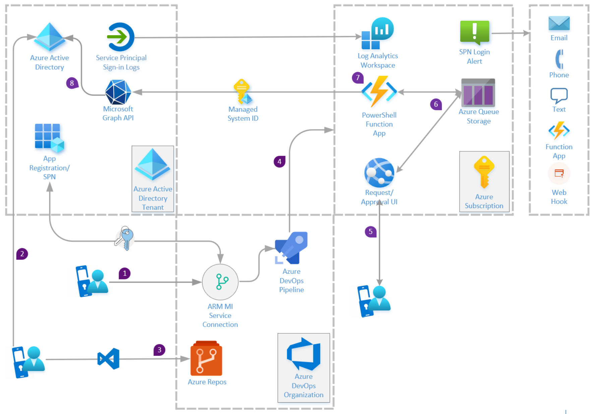

# PROPOSED SOLUTION

## TABLE OF CONTENTS

- [PROPOSED SOLUTION](#proposed-solution)
  - [TABLE OF CONTENTS](#table-of-contents)
  - [ARCHITECTURE DESIGN](#architecture-design)
    - [1. AZURE DEVOPS AUTHENTICATION](#1-azure-devops-authentication)
    - [2. DEVELOPER AUTHENTICATION](#2-developer-authentication)
    - [3. REPOSITORY AUTHENTICATION](#3-repository-authentication)
    - [4. PIPELINE DEPLOYMENT](#4-pipeline-deployment)
    - [5. USER AUTHENTICATION](#5-user-authentication)
    - [6. FUNCTION APP TRIGGER](#6-function-app-trigger)
    - [7. ASSIGN MANAGED ID ROLES](#7-assign-managed-id-roles)
      - [MICROSOFT GRAPH AUTHENTICATION](#microsoft-graph-authentication)
      - [ASSIGNING MANAGED ID THE APPLICATION ADMINISTRATOR ROLE](#assigning-managed-id-the-application-administrator-role)
    - [8. MANAGING AZURE ACTIVE DIRECTORY'S APP REGISTRATIONS](#8-managing-azure-active-directorys-app-registrations)

## ARCHITECTURE DESIGN



---

**STEPS TO COMPLETE SET UP**

This is in draft form. Please feel free to contribute

---

### 1. AZURE DEVOPS AUTHENTICATION
- User with both the DevOps Organization Owner role as well as the Azure Active Directory role Application Administrator, Application Developer, or Global Administrator) logs into the Azure DevOps organization hosting the project resources for the solution. Under the project settings, select "Service Connections" under the "Pipelines" submenu
- A new Service Connection request is made
- Azure Cloud is the type
- Select "Azure Resource manager" as the service connection type
- Select "Service principal (automatic)" as the type of authentication method
- Set the appropriate scope for the service connection. To publish resources to a resource group, select "Subscription"
- Set the target resource group where your pipeline will deploy resources
- Name your service connection
- Give your service connection a name
- Uncheck "Grant access permission to all pipelines"
- At that point, Azure DevOps connects with Azure Active Directory (Azure AD) and creates an app registration with a secret that's valid for two years. The secret and the lifecycle of the Managed ID is managed by Microsoft
- A authentication token is requested and provided by Azure Active Directory using the app registration- thus authenticating the app registration with Azure Active Directory
- An Owner for the target scope will need to assign the app registration the appropriate RBAC role to deploy and manage resources. Least privileged role for your use case would be "Contributor." This will provide the pipeline the role it needs at the appropriate scope to provision the solution's resources in Azure

---

### 2. DEVELOPER AUTHENTICATION
- Developer logs into Azure Active Directory using their work/school account existing in the same tenant
- Your resource template for the Azure Function App needs to define that a "System Assigned Managed ID" be provisioned with the resource. The output of that template will need to be the resource ID of the Function App (once it's created)
- Sample ARM template to create Managed Identity when resource is provisioned: https://docs.microsoft.com/en-us/azure/app-service/overview-managed-identity?tabs=dotnet#using-an-azure-resource-manager-template-1
- Developer requests and is provided with an access token from Azure Active Directory
- Develop uses this token to authenticate their IDE with Azure AD

---

### 3. REPOSITORY AUTHENTICATION
- Developer edits, saves, and commits template code
- Developer commits changes to the Azure DevOps repo hosting their solution's code
- Branch Policies will be leveraged to protect the main branch from direct merges with the main branch, by requiring a pull request be submitted that must be approved by a stakeholder (security, Azure admin, etc.).
- For CI/CD, the pipeline should be set to trigger when the pull request has been approved

---

### 4. PIPELINE DEPLOYMENT

Pipeline deploys the following resources using the App Registration to authenticate with Azure Active Directory
- App service
- Storage account using Queue storage

---

### 5. USER AUTHENTICATION
- Provisioning tool proposed steps (Customer team will provide the workflow/code involving the request and provide the user with status- received, pending, approval/denial, and notification of closed request)
- User logs into request App Service UI using the Azure Active Directory identity using their home/school account that exists in the target tenant.
- Access token is requested and returned to the app service authenticating user with Azure Active Directory
- User submits request details

---

### 6. FUNCTION APP TRIGGER

The Function app is triggered by the queue storage (authenticating to the storage account using the Function apps System Managed ID

There are other ways to accomplish this- Automation Runbook, Logic App, etc.

---

### 7. ASSIGN MANAGED ID ROLES

#### MICROSOFT GRAPH AUTHENTICATION

Using the Function app's System Managed ID, the Function app will execute a PowerShell script that is used to assign the appropriate Azure Active Directory/API role/permissions
- Azure Active Directory Role
-   Application Administrator (least privileged role)
- Microsoft Graph API Permissions
- Application.ReadWrite.All
- Directory.Read.All
- Group.Read.All
- RoleManagement.ReadWrite.Directory

---

#### ASSIGNING MANAGED ID THE APPLICATION ADMINISTRATOR ROLE

Sample script (this will run using the system managed ID)

```powershell
    'private static async Task<GraphServiceClient> GetGraphApiClient()
Connect-AzureAD
$graph = Get-AzureADServicePrincipal -Filter "AppId eq '<your clientID>'"
$groupReadPermission = $graph.AppRoles `
    | where Value -Like "Group.Read.All" `
    | Select-Object -First 1

# Use the Object Id as shown in the image above
$msi = Get-AzureADServicePrincipal -ObjectId <WEB APP MSI Identity>

New-AzureADServiceAppRoleAssignment `
    -Id $groupReadPermission.Id `
    -ObjectId $msi.ObjectId `
    -PrincipalId $msi.ObjectId `
    -ResourceId $graph.ObjectId
```

---

### 8. MANAGING AZURE ACTIVE DIRECTORY'S APP REGISTRATIONS
- Your Function app can now leverage the App registration's Role assignment and API permissions to add, edit, remove, provide admin consent, etc. for the App registration