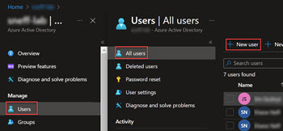
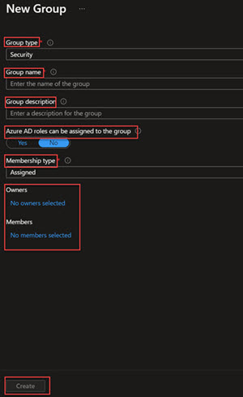
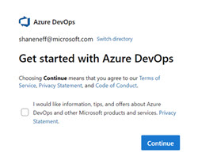
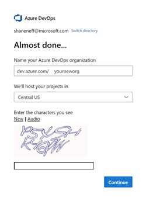
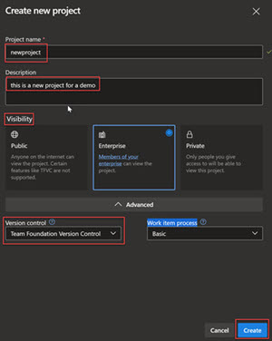
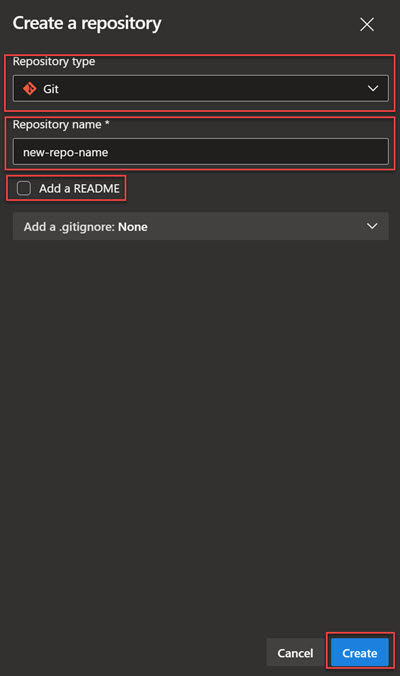
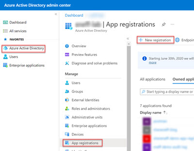
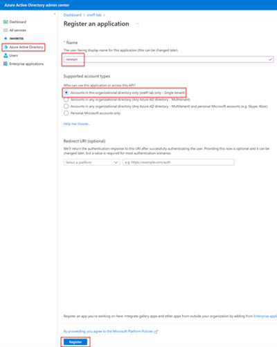
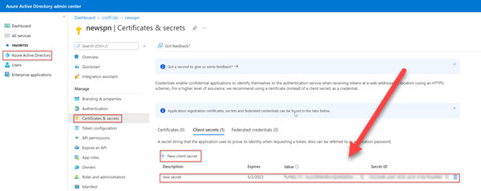

# Demo for Azure DevOps using Azure AD group membership for authentication

*Shane Neff*

*Senior Cloud Solution Architect- Microsoft*

*5/30/2022*

---

# Table of contents

- [Demo for Azure DevOps using Azure AD group membership for authentication](#demo-for-azure-devops-using-azure-ad-group-membership-for-authentication)
  - [PRE-REQUISITES](#pre-requisites)
  - [CREATE/MANAGE AZURE AD USERS AND SECURITY GROUPS](#createmanage-azure-ad-users-and-security-groups)
    - [Create Azure AD User (if applicable)](#create-azure-ad-user-if-applicable)
    - [Create Azure AD Security Group (if applicable)](#create-azure-ad-security-group-if-applicable)
  - [CREATE AZURE DEVOPS ORGANIZATION (if applicable)](#create-azure-devops-organization-if-applicable)
  - [CREATE AZURE DEVOPS PROJECT](#create-azure-devops-project)
  - [CREATE AZURE DEVOPS REPO](#create-azure-devops-repo)
  - [CLONE REPOSITORY LOCALLY](#clone-repository-locally)
  - [CREATE AZURE AD SECURITY PRINCIPAL AND SECRET](#create-azure-ad-security-principal-and-secret)
    - [Create the Service Principal](#create-the-service-principal)
  - [Create the Service Principal Secret](#create-the-service-principal-secret)
  - [CREATE SERVICE CONNECTION](#create-service-connection)
  - [GRANT SPN ACCESS TO AZURE](#grant-spn-access-to-azure)
  - [ASSIGN AAD GROUPS PERMISSIONS IN AZURE DEVOPS](#assign-aad-groups-permissions-in-azure-devops)

---

## PRE-REQUISITES

- Azure Subscription: https://portal.azure.com
- Azure DevOps organization: https://dev.azure.com
- Azure DevOps project
- [VS Code](https://code.visualstudio.com/Download?msclkid=0c447712ca1611ec9099be292e6325e2) (optional)
- Roles Needed:
    - Azure Active Directory Roles:
        - Azure AD role [*Azure DevOps administrator*](https://docs.microsoft.com/en-us/azure/active-directory/roles/permissions-reference?msclkid=254cacc5ca1611ec9f8c24030236ef6c#azure-devops-administrator) (needed to create a new Azure DevOps organization in customer's tenant)
        - Azure AD role Azure [*Application administrator*](https://docs.microsoft.com/en-us/azure/active-directory/roles/permissions-reference?msclkid=254cacc5ca1611ec9f8c24030236ef6c#application-administrator) (least privilege role needed to create Service Principal in customer's tenant)
    - Azure RBAC Roles:
        - [*Owner*](https://docs.microsoft.com/en-us/azure/role-based-access-control/built-in-roles?msclkid=6ba565d5ca1611ecaf8c20fe2f0df3cb#owner) role assigned at the deployment scope (resource group, etc.)
    - Azure DevOps Role: 
        - Azure *DevOps organization owner* (needed to create a new project)
        - Be a member of the [*Project Collection Administrators*](https://docs.microsoft.com/en-us/azure/devops/organizations/security/change-organization-collection-level-permissions?view=azure-devops&tabs=preview-page) group

---

## CREATE/MANAGE AZURE AD USERS AND SECURITY GROUPS

**This step is only needed if Azure AD users, and not AD users that have been replicated to Azure, are used. If accounts are replicated via Azure AD Connect, skip this step as the users/groups will already exist in Azure AD**

### Create Azure AD User (if applicable)

- Navigate to the Azure Active Directory Admin Portal: https://aad.portal.azure.com/
- Navigate to Azure AD Admin portal
- Select *Users*
- Select *Add user* if new user

---

### Create Azure AD Security Group (if applicable)

- Navigate to the Azure Active Directory Admin Portal: https://aad.portal.azure.com/
- Select *Groups*
- Select *All Groups*
- Select *New Group*
- Select *Security* for group type
- Enter Group name
- Enter Group description
- Under *Azure AD roles can be assigned to the group* select *Yes*
- For *Membership Type* enter *Assigned*
- Select group owner from AAD group list
- Select group members from AAD user list

---

## CREATE AZURE DEVOPS ORGANIZATION (if applicable)

- Navigate to https://dev.azure.com
- If no organization exists, a [new organization will need to be created](https://docs.microsoft.com/en-us/azure/devops/organizations/accounts/create-organization?view=azure-devops) 

]

- Enter the name of the organization
- Select a region (Central US is for all US)

---

## CREATE AZURE DEVOPS PROJECT
- Navigate to https://dev.azure.com
- At the root of your organization (new or existing), select *New project*
- Name the project
- Enter a description for the project
- Select appropriate *visibility* option
    - *Public*- visible by anyone
    - *Enterprise*- visible only by users within that same organizational directory as the organization
    - *Private*- only visible to users with assigned roles within the organization/new project
- Select *Version Control* method. There are two types:
    - Git
    - Team Foundation Version Control
        - Select *Git*
- Select *Work item process* and select the appropriate type
    - For the purposes of this tutorial, we will proceed with the defaults (we are not configuring Azure Boards at this time)

---

## CREATE AZURE DEVOPS REPO

- Once the new project has been created, click on *Repos*
- Name the repository
- In the create the repository blade, select *Repository type*
    - Git (select this type of repository)
    - TFVC
- Select the *Add a README* checkbox 

---

## CLONE REPOSITORY LOCALLY

- Navigate to the Azure DevOps portal: https://dev.azure.com
- Select *Repos -> Files*
- Click on *Clone*
- Select *Clone in VS Code*
- Select the location of where the repository will be saved locally. Recommend a location that is not a symbolic link for a directory located in OneDrive
- Once the repository has been cloned locally, select the *Open in new window* option
- Recommendation: make an edit to the *REAMME.md* file, save, commit, and merge to your ADO repository. This will test the configuration of your repository and your local IDE

---

## CREATE AZURE AD SECURITY PRINCIPAL AND SECRET
A [security principal (sometimes known as an SPN)](https://docs.microsoft.com/en-us/azure/active-directory/fundamentals/service-accounts-principal?msclkid=6afe3d9bca5a11ecac7b69878f4020c0) is an identity object stored in Azure Active Directory. This object and its associated secret are used by Azure DevOps to authenticate with your Azure AD tenant and can then be used as an RBAC assignment to provide access to the deployment scope (subscription, management group, resource group, etc.) of the pipeline. This step is required to create a [service connection](https://docs.microsoft.com/en-us/azure/devops/pipelines/library/service-endpoints?msclkid=4f373afdca5a11eca724c679ccfdfa9e&view=azure-devops&tabs=yaml) in Azure DevOps.

### Create the Service Principal

- Navigate to the Azure Active Directory Admin Portal: https://aad.portal.azure.com/
- Navigate to Azure AD Admin portal:
- Click on *App Registrations*
- Click on *New Registration*

- Click *Next*
- Name your Service Principal
- Select *Accounts in this organizational directory only- Single Tenant*

---

## Create the Service Principal Secret

- Click on *Certificates and Secrets*
- Click on *New client secret*
- Name the secret- recommend: a name that is descriptive so that anyone looking can get an idea of what the secret is used for
- Determine secret expiration date- recommend: no more than 24 months
- Click *add*
- Once the secret has been created, open Notepad (or any text editor) and copy the secret value to that file. **The secret will only be shown when created.**
- Also copy the following values from that Service Principal's instance in the AAD admin portal:
    - ClientID (this is also sometimes referred to the application ID)
    - Tenant ID
    - Subscription ID
    - Client secret- captured in the previous step

**Make sure to copy client secret when it is created; it won't be shown once you navigate from that secrets blade**

---

## CREATE SERVICE CONNECTION

- Navigate to the Azure DevOps portal: https://dev.azure.com
- Navigate to your Azure DevOps project
- Within the *Pipelines* section of the settings blade, select *Service Connections*
- Select *Create a Service Connection*
- Select *Azure Resource Manager*
- Select *Next*
- For the purposes of this tutorial, select *Service Principal (manual)
    - Recommendation: utilize the *Service Principal (automatic) when you are both an owner in the target scope and a project administrator
- The next screen is where you'll use the service principal details you copied to your notepad when you created it in an earlier step
    - Environment: *Azure Cloud*
    - Select Scope Level
        - For the purposes of this tutorial, we will use *Subscription* as the Scope of our deployment
    - Enter subscription ID
    - Enter subscription name
    - In the authentication section:
        - Service Principal ID. Enter the GUID value you copied when the service principal was created
        - Credential: *Service Principal Key*
            - Recommendation: if using *Service Principal (manual) you should leverage *Certificate* as the credential type as it is a more secure configuration. This is in a PEM format that includes both the certificate and private key content
    - Tenant ID: enter Tenant ID GUID copied when the service principal was created
    - Click *Verify* to confirm the connection was successfully established
    - Provide your service connection a name
        - Recommendation is to use a name that describes as best as possible the SPN's intended use
    - (Optional) Provide a description for the service connection 
    - In the *Security* section, uncheck the *Grant access permission to all pipelines*

---

## GRANT SPN ACCESS TO AZURE

- Navigate to the Azure Portal: https://portal.azure.com
- In the search bar, type: *subscriptions*
- Select your target subscription
- Select *IAM and Access Control*
- Under roles, select [*Contributor*](https://docs.microsoft.com/en-us/azure/role-based-access-control/built-in-roles?msclkid=cde23ebbca6011ec9084ff2568100df9#contributor)
    - This is least privileged role to create the resources needed in Azure
- At the conclusion of this step, you'll have an identity object that's been assigned the contributor role in the target subscription. 

---

## ASSIGN AAD GROUPS PERMISSIONS IN AZURE DEVOPS

- Navigate to the Azure DevOps portal: https://dev.azure.com

