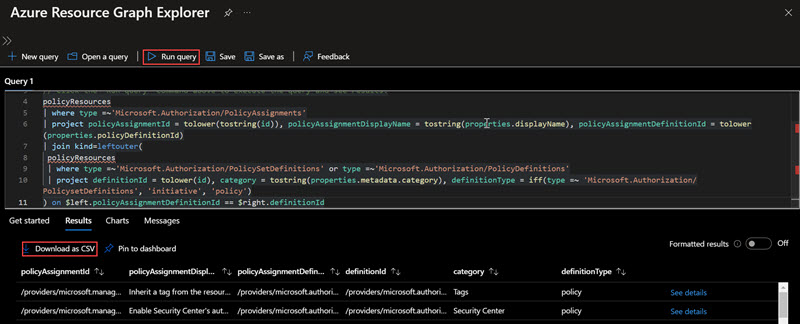

# Export Resources and Azure Policies from Azure

*Shane Neff*

*Senior Cloud Solution Architect- Microsoft*

*5/30/2022*

---

## TABLE OF CONTENTS

- [Export Resources and Azure Policies from Azure](#export-resources-and-azure-policies-from-azure)
  - [QUERY TOOLS](#query-tools)
    - [*PowerShell*](#powershell)
    - [*Resource Graph*](#resource-graph)
  - [PRE-REQUISITES](#pre-requisites)
  - [EXPORT LIST OF RESOURCES IN AZURE](#export-list-of-resources-in-azure)
  - [CREATE AN AZURE POLICY ASSIGNMENT REPORT](#create-an-azure-policy-assignment-report)


## QUERY TOOLS

### *PowerShell*

To retrieve the list of resources provisioned in your Azure environment, we will be using PowerShell. A script has already been created for you and instructions on how to use it can be found in the details below. 

### *Resource Graph*
To retrieve a list of Azure Policy assignments in your environment, we will be using [Azure Resource Graph](https://docs.microsoft.com/en-us/azure/governance/resource-graph/). The instructions on how to use this tool are detailed below.

---

## PRE-REQUISITES

- Azure Subscription: https://portal.azure.com
- RBAC role:
    - Least privilege RBAC role assignment is the *Reader* role at the scope required to run the report. To generate the query results for all resources in your tenant, the user running the queries must have the *Reader* role assigned at the Tenant Root Management Group scope
- Windows PowerShell

---

## EXPORT LIST OF RESOURCES IN AZURE
This will create a .csv file listing all of the resources in your environment, and separate them out by subscription in different tabs

To run this script:
- [Download the script file](https://github.com/nanigan/nanigan/blob/main/Scripts/Get-AzureInventory.ps1) to your downloads directory
- Open Windows PowerShell and cd to the location (downloads) where the file is located, then type in *".\Get-AzureInventory.ps1*"
    - For example:

```powershell
PS C:\ cd "C:\Users\<your user profile>\Downloads"
PS C:\ .\Get-AzureInventory.ps1
```
Below is the actual script- it should not need to be edited and can be run 'as is' and is only included below for reference to help you better understand what is happening 'under the covers' when the script is run

```powershell
<#
.SYNOPSIS
    Get an inventory of your Azure environment
.DESCRIPTION
    The script exports your Azure inventory as a CSV file. It builds different CSV files for each subscription with resources. 
.EXAMPLE
    PS C:\> .\Get-AzureEnvironment.ps1
    Gets all resources in all available subscriptions and exports them to CSV files
.EXAMPLE
    PS C:\> .\Get-AzureEnvironment.ps1 -SubscriptionId <subscription-id>
    Gets all resources in a particular subscription and exports them to CSV files
.PARAMETER SubscriptionId
    (optional) Specifies the subscription.
.LINK
    https://github.com/cloudchristoph/AzureInventory
#>
[CmdletBinding()]
param (
    # (optional) Specifies the subscription.
    [Parameter()]
    [string]$SubscriptionId = ""
)

Write-Verbose -Message "Getting subscriptions"
try {
    if ($SubscriptionId.Length -eq 0) {
        $subscriptions = Get-AzSubscription
    } else {
        $subscriptions = Get-AzSubscription -SubscriptionId $SubscriptionId
    }    
}
catch [Microsoft.Open.Azure.AD.CommonLibrary.AadNeedAuthenticationException] { 
    Write-Warning -Message "You're not connected. Connecting now."
    Connect-AzAccount
    if ($SubscriptionId.Length -eq 0) {
        $subscriptions = Get-AzSubscription -ErrorAction Stop
    } else {
        $subscriptions = Get-AzSubscription -SubscriptionId $SubscriptionId -ErrorAction Stop
    }    
}
Write-Verbose -Message "Found $($subscriptions.Length) subscription(s)"

$subscriptions | Export-Csv -Path "./subscriptions.csv"

foreach ($subscription in $subscriptions) {
    $pathInventory = "./inventory_$($subscription.Id).csv"
    $pathMarketplace = "./marketplace_$($subscription.Id).csv"
    Write-Verbose -Message "Getting resources from subscription $($subscription.Name)"
    Select-AzSubscription -SubscriptionObject $subscription
    $ressources = Get-AzResource | Select-Object ResourceName, ResourceGroupName, ResourceType, Sku
    if ($ressources.Length -gt 0) {
        Write-Verbose -Message "$($ressources.Length) resources found"
        $ressources | Export-Csv -Path $pathInventory
        $marketplaceItems = $ressources | Where-Object { $_.ResourceType -notlike "Microsoft.*" } 
        if ($marketplaceItems.Length -gt 0) {
            Write-Verbose -Message "$($marketplaceItems.Length) marketplace resources found"
            $marketplaceItems | Export-Csv -Path $pathMarketplace
        }
    }
}
```

## CREATE AN AZURE POLICY ASSIGNMENT REPORT
To export a list of policy assignments, we will use Azure [Azure Resource Graph](https://docs.microsoft.com/en-us/azure/governance/resource-graph/). There are ways to retrieve this list using PowerShell, however this exports all of the policy information with minimal coding.

Azure Resource Graph uses the [Kusto Query Language (KQL)](https://docs.microsoft.com/en-us/azure/data-explorer/data-explorer-overview)

To access the Azure Resource Graph query tool:
- Navigate to the Azure Portal: https://portal.azure.com
- In the search window, type *Resource Graph*
- Copy/Paste the query below in the query window
- Click on the *Run Query* button

Example:



Copy and paste the query below:

```k
policyResources
| where type =~'Microsoft.Authorization/PolicyAssignments'
| project policyAssignmentId = tolower(tostring(id)), policyAssignmentDisplayName = tostring(properties.displayName), policyAssignmentDefinitionId = tolower(properties.policyDefinitionId)
| join kind=leftouter(policyResources
| where type =~'Microsoft.Authorization/PolicySetDefinitions' or type =~'Microsoft.Authorization/PolicyDefinitions'
| project definitionId = tolower(id), category = tostring(properties.metadata.category), definitionType = iff(type =~ 'Microsoft.Authorization/PolicysetDefinitions', 'initiative', 'policy')
) on $left.policyAssignmentDefinitionId == $right.definitionId
```
Once the query has been run, simply click on the *Download as CSV* to retrieve the output of your query in a csv format.

Running this query will return the following:

- policyAssignmentId
    - This defines the policy assignment ID, and includes the assignment scope and the policy name
- policyAssignmentDisplayName
    - Example: "Kubernetes cluster should not allow privileged containers"
- policyAssignmentDefinitionId
    - GUID for the policy assignment
    - Example: /providers/microsoft.authorization/policydefinitions/95edb821-ddaf-4404-9732-6660...
- category
    - Policy category
    - Example: Kubernetes
- definitionType
    - This is either an Azure Policy, or an Azure Policy initiative

---
