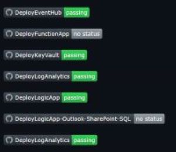

# Shane Neff's Handy List of Tips/Tools

The words expressed here are my own and do not reflect the opinions of any other third party. No warranty (written or implied) is provided, and you are recommended to test any proposed solution before attempting to deploy it in a production environment. Please review [license information](https://nanigan.github.io/nanigan/LICENSE) for specifics around any topic. 

# Table of contents

  - [Provide external IDs access to resource tenant using alternate MFA methods](#provide-external-ids-access-to-resource-tenant-using-alternate-mfa-methods)
  - [Copying data from SharePoint Online to Azure files](#copying-data-from-sharepoint-online-to-azure-files)
  - [How to add an RSS Feed to Markdown](#how-to-add-an-rss-feed-to-markdown)
  - [How to integrate your Postman API collection into Azure CI/CD Pipelines](#how-to-integrate-your-postman-api-collection-into-azure-cicd-pipelines)
  - [How to add a Deployment Badge in Markdown](#how-to-add-a-deployment-badge-in-markdown)
  - [How to add "Deploy to Azure" button in Markdown](#how-to-add-deploy-to-azure-button-in-markdown)
  - [How Create Azure DevOps Service Connection](#how-create-azure-devops-service-connection)
  - [Find available Azure VM SKUs per region using PowerShell](#find-available-azure-vm-skus-per-region-using-powershell)
  - [Export Resource and Policy List](#export-resource-and-policy-list)
  - [Create Azure DevOps Service Connection](#create-azure-devops-service-connection)
  - [Manager Defender for Endpoint](#manager-defender-for-endpoint)
  - [Use Azure Data Factory (ADF) to copy data from SharePoint Online to Azure Files](#use-azure-data-factory-adf-to-copy-data-from-sharepoint-online-to-azure-files)
  - [Copying files from SharePoint Online to Azure Files](#copying-files-from-sharepoint-online-to-azure-files)

## Provide external IDs access to resource tenant using alternate MFA methods

Documentation around the various methods to provide access to external IDs leveraging MFA challenges from the guest users home tenant

[How to Instructions](https://nanigan.github.io/nanigan/provideExternalIdentitiesAlternateMFA.html)

## Copying data from SharePoint Online to Azure files
Walk through of setting up an Azure Data Factory Pipeline that extracts data from a specified SharePoint Site and copies it to an Azure Files instance in Azure 

[How to Instructions](https://nanigan.github.io/nanigan/adfCopySpoDataToAzureFiles.html)

## How to add an RSS Feed to Markdown
This entry will walk through how to add your RSS feed(s) to your README (or any Markdown file). The workflow is currently set to trigger on time of day. The example runs the workflow every night at 8:00 PM

[How to Instructions](https://nanigan.github.io/nanigan/addRssFeedToGitHubProfileExample.html)

Credit to [Jason Etcovitch](https://github.com/JasonEtco)

## How to integrate your Postman API collection into Azure CI/CD Pipelines
This entry will walk through how to utilize PostMan to manage your Azure Infrastructure using REST API

[How to Instructions](https://medium.com/@dkelaartdul/how-to-integrate-your-postman-api-collection-into-azure-ci-cd-pipelines-e9ed4302f1d6)

## How to add a Deployment Badge in Markdown
This entry will walk through how to add a deployment status badge that displays the status of your workflow runs. It is updated each time the workflow has been run

[How to Instructions](https://nanigan.github.io/nanigan/createDeploymentBadge.html)

## How to add "Deploy to Azure" button in Markdown
This entry walks through how to add a "Deploy to Azure" button in your Markdown file. This enables users to have a one-click Azure Portal deployment experience

[How to Instructions](https://nanigan.github.io/nanigan/deployToAzureInstructions.html)

## Find available Azure VM SKUs per region using PowerShell

[How to Instructions](https://nanigan.github.io/nanigan/Scripts/Get-VMRegionAvailability.ps1)

Credit to [Elan Shudnow](https://github.com/ElanShudnow) as he did most of the heavy lifting on this one

## Export Resource and Policy List

[How to Instructions](https://nanigan.github.io/nanigan/exportResourcesAndPolicies.html)

## Create Azure DevOps Service Connection

[How to Instructions](https://nanigan.github.io/nanigan/createAdoServiceConnection.html)

## Manager Defender for Endpoint

[How to Instructions](https://nanigan.github.io/nanigan/manageDefenderForEndpoint.html)

## Use Azure Data Factory (ADF) to copy data from SharePoint Online to Azure Files

[How to Instructions](https://nanigan.github.io/nanigan/adfCopySpoDataToAzureFiles.html)

## Azure Migrate Set Up Instructions

[How to Instructions](https://nanigan.github.io/nanigan/migrateApplianceInstructions.html)

## Manage Microsoft Defender for Endpoint Device Groups

[How to instructions](https://nanigan.github.io/nanigan/manageMdePortal.html)