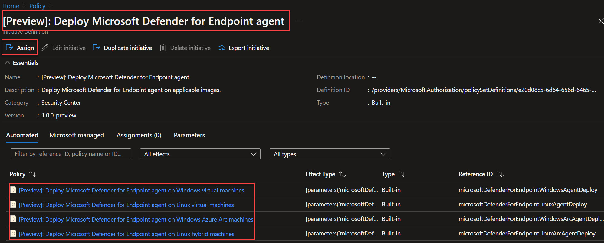

# Configure the automated deployment of Defender for endpoint

*Shane Neff*

*Senior Cloud Solution Architect- Microsoft*

*5/30/2022*

---

# Table of contents

- [Configure the automated deployment of Defender for endpoint](#configure-the-automated-deployment-of-defender-for-endpoint)
  - [Setting Pricing Value for Defender for Cloud](#setting-pricing-value-for-defender-for-cloud)
    - [Using PowerShell Script](#using-powershell-script)
    - [Using an ARM Template](#using-an-arm-template)
    - [Using Azure Policy](#using-azure-policy)
    - [Using the Policy Portal Experience](#using-the-policy-portal-experience)
    - [Deploy Log Analytics Agent on Azure VMs](#deploy-log-analytics-agent-on-azure-vms)
  - [Deploy Vulnerability Assessment](#deploy-vulnerability-assessment)

---

## Setting Pricing Value for Defender for Cloud

### Using PowerShell Script

```powershell
Set-AzSecurityPricing -Name "virtualmachines" -PricingTier "Standard"
```
---

### Using an ARM Template 
Reource provider: [Microsoft.Security/pricings](https://docs.microsoft.com/en-us/azure/templates/microsoft.security/pricings?tabs=json) This template will also auto-provisioning security settings.

Excerpt:
```json
    "resources": [
        {
            "type": "Microsoft.Security/autoProvisioningSettings",
            "name": "default",
            "apiVersion": "2017-08-01-preview",
            "properties": {
                "autoProvision": "[parameters('autoProvisioning')]"
            }
        },
        {
            "type": "Microsoft.Security/workspaceSettings",
            "apiVersion": "2017-08-01-preview",
            "name": "default",
            "properties": {
                "workspaceId": "/subscriptions/,<your subscription ID>,/resourcegroups/<your resource group name>/providers/microsoft.operationalinsights/workspaces/<workspace name>",
                "scope": "[subscription().id]"
            }
        },
        {
            "type": "Microsoft.Security/pricings",
            "apiVersion": "2018-06-01",
            "name": "VirtualMachines",
            "properties": {
                "pricingTier": "[parameters('pricingTierVMs')]"
            }
        }
    ]...  
```
---

### Using Azure Policy
Using a built-in Azure Policy initiative that can be assigned at any scope within Azure that the role assignment permits. This can assigned within the Policy management blade in the Azure Portal, or using source control and automation.

Original built-in policy set:

- [[Preview]: [Preview]: Deploy Microsoft Defender for Endpoint agent](https://github.com/Azure/azure-policy/blob/master/built-in-policies/policySetDefinitions/Security%20Center/ASC_MicrosoftDefenderForEndpointAgent.json)

The original built-in policy initiative was cloned and exported. This is now listed as a custom policy intiative

The new customer policy initiative is called: "Deploy Defender for Endpoint Agent" and includes the folowing built-in policies that deploy the agent to all VM types:

Policy initiative deploying the agent to all image types (you may deploy the policies separately, if you choose to not deploy them all at once:

- [[Preview]: [Preview]: Deploy Microsoft Defender for Endpoint agent on Linux hybrid machines](https://portal.azure.com/#blade/Microsoft_Azure_Policy/PolicyDetailBlade/definitionId/%2Fproviders%2FMicrosoft.Authorization%2FpolicyDefinitions%2F4eb909e7-6d64-656d-6465-2eeb297a1625)

- [[Preview]: [Preview]: Deploy Microsoft Defender for Endpoint agent on Linux virtual machines](https://portal.azure.com/#blade/Microsoft_Azure_Policy/PolicyDetailBlade/definitionId/%2Fproviders%2FMicrosoft.Authorization%2FpolicyDefinitions%2Fd30025d0-6d64-656d-6465-67688881b632)

- [[Preview]: [Preview]: Deploy Microsoft Defender for Endpoint agent on Windows Azure Arc machines](https://portal.azure.com/#blade/Microsoft_Azure_Policy/PolicyDetailBlade/definitionId/%2Fproviders%2FMicrosoft.Authorization%2FpolicyDefinitions%2F37c043a6-6d64-656d-6465-b362dfeb354a)

- [[Preview]: [Preview]: Deploy Microsoft Defender for Endpoint agent on Windows virtual machines](https://portal.azure.com/#blade/Microsoft_Azure_Policy/PolicyDetailBlade/definitionId/%2Fproviders%2FMicrosoft.Authorization%2FpolicyDefinitions%2F1ec9c2c2-6d64-656d-6465-3ec3309b8579)

---

### Using the Policy Portal Experience
Navigate to: https://portal.azure.com

- Type "policy" in the portal search box
- Select "Policy"
- Select "Policy Definitions"
- In the search box, type "[Preview]: Deploy Microsoft Defender for Endpoint agent"
- Select the policy
- Select the "Assign" button to assign the policy
- Follow wizard to deploy to your desired scope



---

### Deploy Log Analytics Agent on Azure VMs
This will automatically on-boards Azure VMs by installing the Azure Log Analytics Agent using the built-in Azure Policy "[Preview]: Configure machines to automatically install the Azure Monitor and Azure Security agents on virtual machines"


```json
{
 "properties": {
  "displayName": "[Preview]: Configure machines to automatically install the Azure Monitor and Azure Security agents on virtual machines",
  "policyType": "BuiltIn",
  "description": "Configure machines to automatically install the Azure Monitor and Azure Security agents. Security Center collects events from the agents and uses them to provide security alerts and tailored hardening tasks (recommendations). Create a resource group and Log Analytics workspace in the same region as the machine to store audit records. This policy only applies to VMs in a few regions.",
  "metadata": {
   "category": "Monitoring",
   "version": "3.0.0-preview",
   "preview": true
  }...
```
---

## Deploy Vulnerability Assessment
This automatically installs the Vulnerability (Qualys) using the build in Azure Policy initiative "[Preview]: Configure machines to automatically install the Azure Monitor and Azure Security agents on virtual machines"

Excerpt:
```json
{
 "properties": {
  "displayName": "[Preview]: Configure machines to automatically install the Azure Monitor and Azure Security agents on virtual machines",
  "policyType": "BuiltIn",
  "description": "Configure machines to automatically install the Azure Monitor and Azure Security agents. Security Center collects events from the agents and uses them to provide security alerts and tailored hardening tasks (recommendations). Create a resource group and Log Analytics workspace in the same region as the machine to store audit records. This policy only applies to VMs in a few regions.",
  "metadata": {
   "category": "Monitoring",
   "version": "3.0.0-preview",
   "preview": true
  },
  ...
  ```


