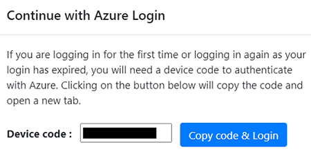

# AZURE MIGRATE APPLIANCE SETUP/CONFIGURATION

*Authored by:*

*Shane Neff*

*Senior Cloud Solution Architect- Microsoft*

*7/7/2022*

---

## Azure Migrate Service Overview

The Azure Migrate service provides a central hub to track discover, assess, and migrate your on-premises apps and workloads and private and public cloud VMs to Azure. The hub provides Azure Migrate tools for assessment and migration and third-party ISV offerings

References:

- [Azure Migrate Service Oerview](https://docs.microsoft.com/en-us/azure/migrate/migrate-services-overview)
- [Azure Migrate Discovery and assessment tool](https://docs.microsoft.com/en-us/azure/migrate/migrate-services-overview#azure-migrate-discovery-and-assessment-tool)

The tool performs the following functions:
- Azure readiness: Assesses whether on-premises servers are ready for migration to Azure
- Azure sizing: Estimates the size of Azure VMs
- Azure cost estimation: Estimates costs for running on-premises servers in Azure.
- Dependency analysis: Identifies cross-server dependencies and optimization strategies for moving interdependent servers to Azure

---

# Requirements

The following sections document the network, vCenter, and the Azure Migrate appliance requirements, that when met, will enable you to complete the remaining tasks.

## Network Configuration

The first task that needs to be performed is to ensure that the Azure Migrate appliance has the required **OUTBOUND** connectivity over TCP port 443 (HTTPS/SSL)

When you deploy the appliance, Azure Migrate does a connectivity check to the required URLs.
You need to allow access to all URLs in the list. If you're doing assessment only, you can skip the URLs that are marked as required for VMware agentless migration.
If you're using a URL-based proxy to connect to the internet, make sure that the proxy resolves any CNAME records received while looking up the URLs

**URL List**

| URL                                                                                                                                                                                	| Details                                                                                              	|
|------------------------------------------------------------------------------------------------------------------------------------------------------------------------------------	|------------------------------------------------------------------------------------------------------	|
| *.portal.azure.com                                                                                                                                                                 	| Navigate to the Azure portal.                                                                        	|
| *.windows.net *.msftauth.net *.msauth.net *.microsoft.com *.live.com *.office.com *.microsoftonline.com *.microsoftonline-p.com *.microsoftazuread-sso.com 	| Used for access control and identity management by Azure Active Directory                            	|
| management.azure.com                                                                                                                                                               	| Used for resource deployments and management operations                                              	|
| *.services.visualstudio.com                                                                                                                                                        	| Upload appliance logs used for internal monitoring.                                                  	|
| *.vault.azure.net                                                                                                                                                                  	| Manage secrets in the Azure Key Vault. Note: Ensure servers to replicate have access to this.     	|
| aka.ms/*                                                                                                                                                                           	| Allow access to these links; used to download and install the latest updates for appliance services. 	|
| download.microsoft.com/download                                                                                                                                                    	| Allow downloads from Microsoft download center.                                                      	|
| *.servicebus.windows.net                                                                                                                                                           	| Communication between the appliance and the Azure Migrate service.                                   	|
| *.discoverysrv.windowsazure.com *.migration.windowsazure.com                                                                                                                    	| Connect to Azure Migrate service URLs.                                                               	|
| *.hypervrecoverymanager.windowsazure.com                                                                                                                                           	| Used for VMware agentless migration  Connect to Azure Migrate service URLs.                    	|
| *.blob.core.windows.net                                                                                                                                                            	| Used for VMware agentless migration  Upload data to storage for migration.                     	|

---
## VMware Requirements

- vCenter Server running 5.5, 6.0, 6.5, 6.7 or 7.0 
- ESXi host running version 5.5 or later
- Enough resources on the vCenter Server to create a server that meets the hardware requirements
- To use the appliance for agentless migration of servers, the VMware vSphere VDDK must be installed on the appliance server

---

## Azure Migrate Agentless Appliance System Requirements

For agentless migration, Server Migration uses the same appliance that is used by the discovery and assessment appliance for discovery and assessment of servers.

Requirements:

- Windows Server 2016, with 32 GB of memory, eight vCPUs, around 80 GB of disk storage
    - *Currently the deployment of appliance is only supported on Windows Server 2016*
- The appliance requires internet access, either directly or through a proxy
- Please see the [Network Requirements section of this documents](#NETWORK-REQUIREMENTS) for a list of required URLs

---

## Deploy Azure MIgrate Appliance

The appliance will be deployed on **ONE** new VM on a vCenter Server using an .OVA template. The following are the steps to take in order to provision and configure the Azure Migrate appliance:

- Download the OVF Template: https://go.microsoft.com/fwlink/?linkid=2140333
    - Download size is 11.9 GB
    - The downloaded appliance template comes with a Windows Server 2016 evaluation license, which is valid for 180 days
- In the vSphere Client console, select File > Deploy OVF Template
- Select .OVA file downloaded in the first step
- In Name, enter a name for the server
- In Location, select the inventory object in which the server will be hosted
- In Host/Cluster, select the host or cluster on which the server will run
- In Storage, select the storage destination for the server
- In Disk Format, select the disk type and size
- In Network Mapping, select the network the server will connect to 
- The network requires internet connectivity to send metadata to Azure Migrate as well as other outbound network requirements **(see network requirements in the [Network Requirements section of this documents](#NETWORK-REQUIREMENTS)
- Review and confirm the settings, and then select Finish
- Verify appliance access to Azure
- Make sure that the appliance server can connect to the Azure URLs referenced in the following section
- Turn off appliance auto-updates
    - On the server running the appliance, open the Registry Editor
    - Navigate to HKEY_LOCAL_MACHINE\SOFTWARE\Microsoft\AzureAppliance
    - To turn off auto-update, create a registry key AutoUpdate key with DWORD value of 0

# -> STOP HERE <-

# -> RESUME HERE AS A TEAM WEEK OF 7/18 <-

This section is in **draft** form, please take caution if continuing on your own

## Configure Azure Migrate Appliance

- In vSphere Client, right-click the server, and then select Open Console
- Select or enter the language, time zone, and password for the appliance
- Open a browser on any server that can connect to the appliance server
- Open the URL of the appliance configuration manager: https://appliance name or IP address: 44368
- Accept the license terms and read the third-party information

**Register the appliance**

- In the configuration manager, select Set up prerequisites, and then complete these steps:
- Connectivity: The appliance checks that the server has internet access
- If the server will connect the the Azure URLs uses a proxy follow these steps:
    - Select Setup proxy to specify the proxy address (in the form http://ProxyIPAddress or http://ProxyFQDN, where FQDN refers to a fully qualified domain name) and listening port
    - Enter credentials if the proxy needs authentication
    - If you have added proxy details or disabled the proxy or authentication, select Save to trigger connectivity and check connectivity again
    - ***Only HTTP proxy is supported***
    - Time sync: Check that the time on the appliance is in sync with internet time for discovery to work properly
    - Install updates and register appliance: To run auto-update and register the appliance

- For the appliance to run auto-update, paste the project key that you copied from the portal. If you don't have the key, go to Azure Migrate: Discovery and assessment > Overview > Manage existing appliances. Select the appliance name you provided when you generated the project key, and then copy the key that's shown
- The appliance will verify the key and start the auto-update service, which updates all the services on the appliance to their latest versions. When the auto-update has run, you can select View appliance services to see the status and versions of the services running on the appliance server
- To register the appliance, you need to select Login. In Continue with Azure Login, select Copy code & Login to copy the device code (you must have a device code to authenticate with Azure) and open an Azure Login prompt in a new browser tab. Make sure you've disabled the pop-up blocker in the browser to see the prompt

- In a new tab in your browser, paste the device code and sign in by using your Azure username and password
    - Signing in with a PIN isn't supported
    - If you close the login tab accidentally without logging in, refresh the browser tab of the appliance configuration manager to display the device code and Copy code & Login button
- After you successfully log in, return to the browser tab that displays the appliance configuration manager. If the Azure user account that you used to log in has the required permissions for the Azure resources that were created during key generation, appliance registration starts
- Install the VDDK: The appliance checks that VMware vSphere Virtual Disk Development Kit (VDDK) is installed. If the VDDK isn't installed, download VDDK 6.7 from VMware. Extract the downloaded zip file contents to the specified location on the appliance, as indicated in the Installation instructions
    - Azure Migrate Server Migration uses the VDDK to replicate servers during migration to Azure
    - You can rerun prerequisites at any time during appliance configuration to check whether the appliance meets all the prerequisites
- Start continuous discovery
    - Complete the setup steps in the appliance configuration manager to prepare for and start discovery

---

## Start continuous discovery

**Provide vCenter Server details**

The appliance must connect to vCenter Server to discover the configuration and performance data of the servers:

- Provide vCenter Server credentials, select Add credentials to enter a name for the credentials. Add the username and password for the vCenter Server account that the appliance will use to discover servers running on vCenter Server
- You should have set up an account with the required permissions as described earlier in this article
- If you want to scope discovery to specific VMware objects (vCenter Server datacenters, clusters, hosts, folders of clusters or hosts, or individual servers), review the instructions to set discovery scope to restrict the account that Azure Migrate uses
- If you want to add multiple credentials at once, click on Add more to save and add more credentials. Multiple credentials are supported for discovery of servers across multiple vCenter Servers using a single appliance
- Provide vCenter Server details, select Add discovery source to add the IP address or FQDN of a vCenter Server. You can leave the port as the default (443) or specify a custom port on which vCenter Server listens. Select the friendly name for credentials you would like to map to the vCenter Server and click Save
- Click on Add more to save the previous details and add more vCenter Server details. You can add up to 10 vCenter Servers per appliance

- The appliance attempts to validate the connection to the vCenter Server(s) added by using the credentials mapped to each vCenter Server. It displays the validation status with the vCenter Server(s) IP address or FQDN in the sources table.
- You can revalidate the connectivity to vCenter Server(s) anytime before starting discovery

**Provide server credentials**

- Provide server credentials to perform software inventory, agentless dependency analysis, discovery of SQL Server instances and databases and discovery of ASP.NET web apps in your VMware environment., you can provide multiple server credentials. If you don't want to use any of these appliance features, you can skip this step and proceed with vCenter Server discovery. You can change this option at any time

- If you want to use these features, provide server credentials by completing the following steps. The appliance attempts to automatically map the credentials to the servers to perform the discovery features.

**To add server credentials:**

- Select Add Credentials
- In the dropdown menu, select Credentials type
    - You can provide domain/, Windows(non-domain)/, Linux(non-domain)/, and SQL Server authentication credentials. Learn how to provide credentials and how we handle them
    - For each type of credentials, enter:
        - A friendly name
        - A username
        - A password. Select Save
    - If you choose to use domain credentials, you also must enter the FQDN for the domain 
    - The FQDN is required to validate the authenticity of the credentials with the Active Directory instance in that domain.
- Review the required permissions on the account for Step 3: Provide server credentials to perform software inventory, agentless dependency analysis, discovery of SQL Server instances and databases and discovery of ASP.NET web apps
- To add multiple credentials at once, select Add more to save credentials, and then add more credentials. When you select Save or Add more, the appliance validates the domain credentials with the domain's Active Directory instance for authentication. Validation is made after each addition to avoid account lockouts as the appliance iterates to map credentials to respective servers

**Check validation of the domain credentials:**

- In the configuration manager, in the credentials table, see the Validation status for domain credentials. Only domain credentials are validated
- If validation fails, you can select a Failed status to see the validation error. Fix the issue, and then select Revalidate credentials to reattempt validation of the credentials

**Start discovery**

To start vCenter Server discovery, in Step 3: Provide server credentials to perform software inventory, agentless dependency analysis, discovery of SQL Server instances and databases and discovery of ASP.NET web apps in your VMware environment., select Start discovery. After the discovery is successfully initiated, you can check the discovery status by looking at the vCenter Server IP address or FQDN in the sources table.

- Provide server credentials to perform software inventory, agentless dependency analysis, discovery of SQL Server instances and databases and discovery of ASP.NET web apps in your VMware environment., select Start discovery. After the discovery is successfully initiated, you can check the discovery status by looking at the vCenter Server IP address or FQDN in the sources table

# Azure Requirements

- An existing or new Azure AD tenant
- An existing or new Azure subscription
- Assignment of appropriate Azure VM built in policies to protect your VMs
- Review of current Azure security posture and make necessary adjustments to host the VMs

**Verify permissions**
- In the Azure portal, open the relevant subscription, and select Access control (IAM).
- In Check access, find the relevant account, and select it view permissions. You should have Contributor or Owner permissions

## Configure Azure

[**Create and manage projects**](https://docs.microsoft.com/en-us/azure/migrate/create-manage-projects)

An Azure Migrate Project is used to store discovery, assessment, and migration metadata collected from the environment you're assessing or migrating. In a project you can track discovered assets, create assessments, and orchestrate migrations to Azure

**Set up a new project in an Azure subscription**

- In the Azure portal, search for Azure Migrate
- In Services, select Azure Migrate
- In Overview, select Discover, assess and migrate

- In Create project, select the Azure subscription and resource group. Create a resource group if you don't have one
- In Project Details, specify the project name and the geography in which you want to create the project
- The geography is only used to store the metadata gathered from on-premises servers. You can select any target region for migration
- Select create
